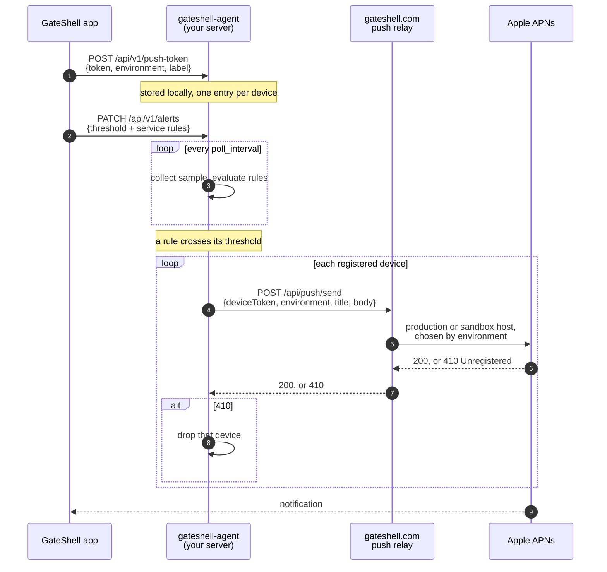

# GateShell Agent

An **optional**, self-hosted binary that runs *on* your own server. It has no
web UI and does not phone home anywhere except the delivery paths you
explicitly configure (the GateShell push relay, for Apple Push — see Alerts
below). It binds **`127.0.0.1` only** — it is *not* reachable from the
network, so there is no exposed port for anyone to hit. The GateShell app
reaches it over the SSH connection it already has to your server (an
SSH-tunnelled, encrypted, host-key-verified channel), so access requires your
server's SSH credentials — only your app can read the data. The bearer token is
kept as defense-in-depth for other local processes on the box. When the
authenticated user starts a Mosh session, the `mosh-server` command opens one
UDP port in the configured 60000–61000 range for that session; the Mosh key
is delivered only through SSH.

This is a standalone, **open-source** Go module — published so you can audit
exactly what runs on your server before you install it. Release binaries are
built by CI and published to this repo's [GitHub Releases](https://github.com/Hefty-Innovations/gateshell-go/releases);
`gateshell.com` hosts a convenience installer that fetches them. It shares no
code with the GateShell app or website (other than talking to the latter's
push relay API, over HTTPS, when configured — see Alerts below).

## What it does

1. **Collects** local host metrics + service health on an interval:
   CPU %, memory used/total, disk used/total, load average, uptime, network
   throughput, top processes, and the status of docker/systemd/pm2/cron
   services. Linux parsers for all of these are real and tested (see
   `internal/collector`) — this isn't a skeleton.
2. **Stores** samples in an embedded SQLite database with tiered retention
   (full resolution for a day, downsampled for longer windows, pruned past
   that — see `internal/store`).
3. **Serves** that data to the GateShell mobile app over a token-authed
   REST + streaming API, so the app can show live/historical server health
   without a cloud backend in between.
4. **Security assessment**: performs deterministic, read-only checks for
   pending system updates, public listeners, SSH authentication policy, host
   firewall state, backup schedules, and local Let's Encrypt certificate
   expiry. Results are cached for five minutes and include evidence plus
   reviewable remediation guidance. The agent never executes remediation.
5. **Alerts**: evaluates threshold rules (a metric over/under a value for a
   duration, or a service flipping up/down) and delivers notifications via
   Apple Push through the GateShell push relay (see Alerts below); rules
   are configured remotely from the mobile app via
   `GET`/`PATCH /api/v1/alerts` and persist across restarts.

   Every paired device is notified, not just the most recent one: each
   registration carries its own APNs environment, so a development-signed
   Mac and a production iPhone both receive, and a device Apple reports as
   permanently gone is dropped rather than retried on every alert. Rules
   can also re-notify at a chosen interval while a metric stays over its
   threshold or a watched service stays down, instead of announcing an
   ongoing problem once and then going quiet.
6. **Mosh transport**: provides a wire-compatible encrypted Mosh server for
   the SSH-authenticated user and a gomobile client bridge for GateShell on
   iPhone, iPad, and Mac. The app verifies the encrypted UDP handshake before
   switching away from SSH.

It is **optional**. GateShell's live SSH connection already gives you
real-time terminal access; the agent adds background monitoring and push
alerts for when you're *not* connected. If the agent isn't installed, or
isn't reachable, the app falls back to live SSH-based checks — the agent
is a nice-to-have, not a dependency for SSH/SFTP. Mosh can use either the
server included in this binary or an existing standard `mosh-server`.

## Architecture

```
cmd/gateshell-agent/    CLI (cobra): serve | pair | version | security-scan | mosh-server
internal/config/        flags + env + JSON/TOML file -> Config (incl. alert rules)
internal/collector/     ticks every PollInterval, gathers a Sample (real Linux parsers + service checkers)
internal/store/         Store interface; memory (default) + sqlite (-tags sqlite)
internal/api/           REST + SSE stream, bearer-token authed
internal/alerts/        threshold + service rules -> push-relay publisher
internal/pushrelay/     HTTPS client to the GateShell push relay (this agent never holds an Apple credential)
internal/securityaudit/ deterministic read-only host assessment
internal/pair/          pairing token generation/validation
mobile/moshbridge/      Apple client API: encrypted UDP/SSP, roaming, prediction
scripts/                reproducible Apple XCFramework build
```

Data flow: `collector` ticks on `PollInterval` → gathers a `Sample` → fans
it out to three sinks: `store.SaveSample` (persistence), `api.Server.
BroadcastSample` (live stream to connected app clients), and `alerts.
Evaluator` (threshold checks → push relay).

### Storage: two builds

- **Default build** (`go build ./...`, no tags): uses `store.MemoryStore`,
  a dependency-free in-memory store. History does **not** survive a
  restart. This exists so the module — and CI — can build and test fully
  offline with just the standard library + cobra.
- **Release build** (`go build -tags sqlite ./...`): uses
  `store.SQLiteStore`, backed by [`modernc.org/sqlite`](https://gitlab.com/cznic/sqlite)
  (a pure-Go SQLite driver — no cgo, no system SQLite dependency). This is
  what `Makefile`'s `build` target and `.goreleaser.yaml` always use.

### API surface

All endpoints except `/healthz` require `Authorization: Bearer <pairing token>`.
The API deliberately has no shell or remote-execution endpoint. Mosh is
started only from an authenticated SSH session, under that SSH user's account.

| Endpoint | Purpose |
|---|---|
| `GET /healthz` | Unauthenticated liveness probe; also reports `version` (the running build's version string) |
| `GET /api/v1/latest` | Most recent sample |
| `GET /api/v1/metrics?from=&to=` | Historical samples in a unix-second time range |
| `GET /api/v1/services` | Service statuses from the latest sample |
| `GET /api/v1/stream` | Live samples as Server-Sent Events |
| `GET /api/v1/config` | Current config, e.g. `{"pollInterval":"60s"}` (`"0s"` = paused) |
| `PATCH /api/v1/config` | Change the poll interval, e.g. `{"pollInterval":"30s"}` — applied at runtime and persisted |
| `GET /api/v1/alerts` | Current alert rule set: `{"rules":[...],"service_rules":[...]}` |
| `PATCH /api/v1/alerts` | Replace the alert rule set — applied at runtime and persisted; rejects an unknown metric/comparator or an unnamed rule |
| `GET /api/v1/security?refresh=1` | Cached or explicitly refreshed read-only security assessment |
| `GET /api/v1/push-token` | Which devices are registered for push (`{"registered":true,"devices":2,"device_labels":["Anil's iPhone","Anil's Mac"]}`) — `503` if no push relay token is configured |
| `POST /api/v1/push-token` | Register a device's APNs token locally: `{"token":"...","environment":"...","label":"Anil's Mac"}` (repeat per device; re-registering the same token updates it in place): `{"token":"...","environment":"production"\|"development"}` — the relay is stateless and only sees this token when an alert actually fires |
| `POST /api/v1/alerts/test` | Send a fixed test message through whatever delivery path(s) are configured, bypassing rule evaluation |

The **poll interval and alert rules are both app-configurable at runtime**:
a `PATCH` reconfigures the collector/evaluator immediately, without a
restart, and writes the value back to the config file so it survives one.
For poll interval, `"0s"` pauses collection; negative values are rejected,
and non-zero values below a 5s minimum are rejected. The initial values
still follow the flags > env > file > default precedence, but because a
`PATCH` persists to the *file*, a `--poll-interval` flag or
`GATESHELL_AGENT_POLL_INTERVAL` env override would win over the persisted
value on the next start — configure these via the file (as `install.sh`
does) for app-driven changes to stick.

`/api/v1/stream` uses Server-Sent Events rather than a WebSocket, to keep
the default build dependency-free (stdlib `net/http` only). SSE is
one-directional, which is all a "push new samples to the app" feed needs;
see the doc comment in `internal/api/api.go` if bidirectional messaging is
ever required.

### Alerts: Apple Push via the relay

How a notification gets from a metric on your server to your phone:



Two properties worth calling out:

- **The agent never holds an Apple credential.** The relay is the only
  party with the APNs key, and it is stateless — it stores nothing between
  requests, so the device token travels with every send.
- **The environment travels with the token.** A token minted by a
  development-signed build is only valid against Apple's sandbox host and a
  production one only against production, so each registration records
  which it is. That is what lets a development Mac and a TestFlight iPhone
  receive from the same agent.

- **GateShell push relay**: set `push_relay_token` in the config file (or
  `--push-relay-token` / `GATESHELL_AGENT_PUSH_RELAY_TOKEN`) to a
  high-entropy secret you generate yourself (e.g. `openssl rand -hex 32`).
  This agent never holds an Apple APNs credential — it only ever POSTs to
  the relay (`gateshell.com` by default; override with `--push-relay-url`
  / `GATESHELL_AGENT_PUSH_RELAY_URL` for a self-hosted relay) over HTTPS,
  authenticated with that token (see `internal/pushrelay`). The relay is
  the only party that ever holds the Apple push key, and it's stateless —
  it stores nothing between requests; every alert carries the device token
  with it. The GateShell app hands its APNs device token to this agent via
  `POST /api/v1/push-token`, which just persists it locally (next to the
  database file) so the agent can attach it to future alerts — with no
  `push_relay_token` configured, `GET /api/v1/push-token` reports `503`,
  and no alerts can be delivered. Installs driven by the
  GateShell app get this automatically — `install-agent.sh` accepts
  `--push-relay-token` and the app generates a fresh one per install. The
  relay never verifies the value against anything (it is stateless by
  design); it only keys the relay's rate limiter per install, so any
  high-entropy string works.

  `environment` on `POST /api/v1/push-token` is the `aps-environment` the
  app was signed with, which it reads from its own provisioning profile.
  It is persisted with the token and forwarded to the relay on every
  alert, because a development-signed build's device token is only valid
  against Apple's sandbox host and a production one only against the
  production host — the relay is stateless and has no other way to tell
  them apart. Omitted means production, which is what every agent and app
  build predating the field was.

Both numeric and service rules carry an optional `repeat_interval`: while a
metric stays over its threshold, or a watched service stays down, the agent
re-sends the alert at that cadence. Omitted or zero
means notify once per episode (a "recovered" message still follows when the
metric comes back), which is how every agent behaved before this field
existed. `for` remains a debounce before the *first* alert, not a cadence.

Alert rules themselves (which metric, what threshold, for how long, which
services to watch) are configured entirely from the mobile app via
`GET`/`PATCH /api/v1/alerts` — there's no rule-authoring surface on the
agent side itself.

## Build & run

```sh
# Offline-friendly sanity build (in-memory store, no external deps beyond cobra):
go build ./...
go vet ./...

# Real build, with the durable sqlite store:
make build          # -> bin/gateshell-agent
# equivalent to: go build -tags sqlite -o bin/gateshell-agent ./cmd/gateshell-agent

make test           # runs tests under both build configurations
make vet
make tidy           # tidies go.mod/go.sum for both build configurations
```

Generate a pairing token, then run the server:

```sh
./bin/gateshell-agent pair
# -> prints a token; paste it into the mobile app's pairing screen

./bin/gateshell-agent serve --token <TOKEN> --listen-addr 127.0.0.1:8443

# Run the same read-only assessment locally without starting the API:
./bin/gateshell-agent security-scan

# Usually launched by GateShell over SSH; prints MOSH CONNECT on success:
./bin/gateshell-agent mosh-server
```

The host firewall must allow the configured UDP range (60000–61000 by
default) for Mosh. GateShell falls back to the existing SSH terminal if the
server is unavailable, its response is invalid, or no authenticated UDP packet
arrives during the handshake window.

Build the embedded Apple client framework reproducibly from the pinned Go
dependencies:

```sh
./scripts/build-apple-mosh.sh /absolute/path/GateShellMosh.xcframework
```

Configuration can come from flags, environment variables
(`GATESHELL_AGENT_*`, see `internal/config/config.go`), or a JSON config
file passed via `--config`. Precedence: flags > env > file > defaults.
Alert rules are only ever set via the file or the runtime API (there's no
flag/env representation for a rule list). A registered push token is
persisted separately, next to the database file (see `internal/pushrelay`).

## Installing on a server

```sh
curl -fsSL https://gateshell.com/dl/install-agent.sh | sh -s -- --token <PAIRING_TOKEN>
```

`install.sh` detects OS/arch, downloads the matching release binary,
installs a systemd unit (`deploy/gateshell-agent.service`), writes a config
file and a secrets env file (both owned by the service user, and the unit's
`ReadWritePaths` includes the config directory — both needed for app-driven
config changes to actually persist), then enables and starts the service.
It's idempotent — safe to re-run to upgrade or rotate the token. It targets
systemd-based Linux, which is the agent's primary deployment target; macOS
is supported for local development only (build from source and run the
binary directly, or supervise it with launchd yourself).

## Status

Released and in active use — see [Releases](https://github.com/Hefty-Innovations/gateshell-go/releases)
for the current version. Metric collection, service checking, the REST/SSE
API, config persistence, security assessment, the Mosh transport, and alert
delivery (multi-device Apple Push via the relay, with repeat notifications
and dead-token pruning) are all real, tested, and shipped. Known gaps:
no TOML config file support yet (JSON only), and `internal/alerts` rules
cover CPU/memory/disk/load-average thresholds and service up/down — no
other metric types yet. See `TODO` comments throughout `internal/` for
specific smaller next steps (e.g. a macOS-native fallback for load
average/uptime, useful for local dev only).
